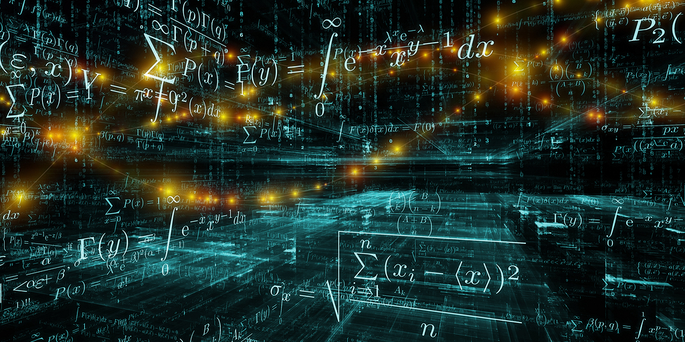

= CEMOSIS

link:http://www.cemosis.fr[Cemosis] (Centre de Modélisation et de Simulation de Strasbourg) a été créé en 2013, il est composé de chercheurs et d’ingénieurs de l’IRMA ainsi que de collaborateurs extérieurs. Son but est de promouvoir et d'augmenter la visibilité et l'influence des mathématiques. Pour cela Cemosis travaille avec d'autres disciplines telle que la physique et la santé avec des projets comme link:http://www.cemosis.fr/projects/tonus[TONUS] et link:http://www.cemosis.fr/projects/vivabrain[Vivabrain] ou encore link:http://www.cemosis.fr/projects/eye2brain[Eye2brain], ainsi qu'avec des entreprises régionales, nationales et mondiales sur des projets comme par exemple link:http://www.cemosis.fr/projects/gazomat/[Gazomat], Socomec, http://www.cemosis.fr/projects/holo3/[Holo3], link:http://www.cemosis.fr/projects/chorus-airbus/[Airbus], link:http://www.cemosis.fr/projects/es-classification-load-curves/[EDF], link:http://www.cemosis.fr/projects/plasticomnium-automotive/[Plastic Omnium] ou encore link:http://www.cemosis.fr/projects/mso4sc/[Atos]. link:http://www.cemosis.fr[Cemosis] travaille naturellement avec le link:http://csmi.eu[Master CSMI] ce qui permet aux étudiants d'appréhender des problèmes variés multi-disciplinaires avec des mathématiques récentes et des fois nouvelles.

Quelques faits marquants:

. Prix du meilleur poster pour Lorenzo Sala (link:http://www.cemosis.fr/projects/eye2brain[Eye2brain]) de l'École Doctorale MSII de l'Université de Strasbourg
. link:http://www.cemosis.fr/blog/2017/10/02/cemosis-et-alsacalcul-services-sunissent/[Cemosis et AlsaCalcul s'unissent pour encore mieux accompagner les entreprises en Alsace]
. link:http://www.mso4sc.eu[Deux projets phares de Cemosis (Eye2brain et Hifimagnet) comme applications pilotes du projet EU H2020 E-INFRA MSO4SC]
